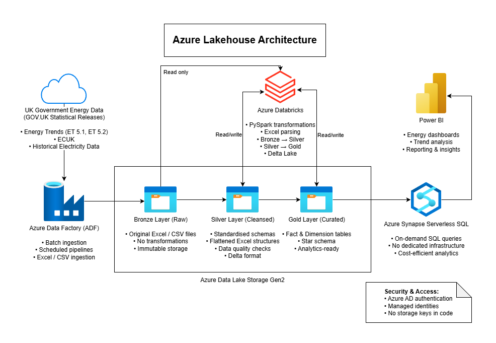

# UK Energy Intelligence Lakehouse Platform

This repository implements an end-to-end data platform for UK energy analytics, ingesting public energy datasets and transforming them using Azure Data Factory, Azure Databricks, Delta Lake, and Synapse serverless SQL. It demonstrates batch ingestion, medallion architecture (Bronze–Silver–Gold), and scalable processing suitable for enterprise pipelines.

## Project Overview

This project demonstrates how large, complex public-sector energy datasets can be transformed into analytics-ready data using modern data engineering best practices.

UK government energy datasets are published in Excel formats with:
- Multiple tables per file
- Inconsistent schemas
- Hierarchical headers
- Monthly, quarterly, and annual reporting structures

The goal of this project is to design and implement a scalable Azure Lakehouse platform that:
- Ingests raw energy datasets
- Cleans and standardises them
- Models them into fact and dimension tables
- Makes them ready for analytics, reporting, and BI consumption

## Business Use Case

Energy policy analysts, regulators, and planners require consistent and reliable data to understand:
- How electricity is generated by fuel type
- How supply and demand components change over time
- Trends in consumption across sectors

However, UK energy data is fragmented across multiple Excel-based statistical releases.

This platform enables:
- Centralised energy data storage
- Consistent metrics across datasets
- Faster policy and operational analysis
- Reliable historical comparisons

The curated Gold layer can directly support:
- Energy mix analysis (renewables vs fossil fuels)
- Supply vs demand balancing
- Long-term energy transition insights

## Architecture Overview

The platform follows a modern Azure Lakehouse architecture:

1. Raw energy datasets are ingested from UK Government sources
2. Azure Data Factory orchestrates ingestion into ADLS Gen2 (Bronze)
3. Azure Databricks performs data cleaning and standardisation (Silver)
4. Curated fact and dimension tables are created in the Gold layer
5. Azure Synapse Serverless enables cost-efficient SQL analytics
6. Power BI can be connected directly to the Gold layer for reporting<br>



## Datasets Used

All datasets are sourced from GOV.UK Energy Trends and official statistics.

| Dataset | Description | Frequency |
|------|------------|----------|
| ET 5.1 | Electricity generation by fuel type | Monthly |
| ET 5.2 | Electricity supply and demand components | Monthly |

## Data Pipeline & Lakehouse Design

The platform follows a Medallion (Bronze–Silver–Gold) architecture.

### Bronze Layer
- Raw Excel files
- Stored exactly as received
- No transformations applied

### Silver Layer
- Cleaned and standardised datasets
- Normalised column names and data types
- Hierarchical Excel structures flattened
- Validated for data quality

### Gold Layer
- Analytics-ready fact and dimension tables
- Star schema modelling
- Optimised for SQL and BI consumption

## 🟡 Gold Layer Design
The Gold layer provides analytics-ready fact tables derived from curated Silver datasets. It is designed to support SQL-based analytics, reporting, and BI tools such as Synapse Serverless and Power BI.

### 🎯 Design Principles
- Business-aligned metrics with clear grain
- Long-format tables for flexible analytics
- Standardized time dimensions (year, quarter)
- Optimized for aggregation and filtering
- Delta Lake format for performance and ACID guarantees

### ⭐ Gold Fact Tables
#### 1. fact_electricity_by_fuel (ET5.1)
This table consolidates multiple ET5.1 tables into a single analytics-friendly structure.

##### Grain:
One row per fuel × generator type × metric × time period

##### Metrics Covered:
- Fuel used in electricity generation (Mtoe)
- Electricity generated by fuel (TWh)
- Electricity supplied by fuel (TWh)

##### Key Columns:
- fuel
- generator_type
- metric_type (fuel_used, electricity_generated, electricity_supplied)
- unit
- period_type (annual / quarterly)
- year
- quarter (Q1–Q4, nullable for annual)
- value
- ingestion_date <br>
This design enables flexible trend analysis across fuels, generators, and time periods.

#### 2. fact_electricity_supply_demand (ET5.2)

This table represents electricity supply and demand components at a quarterly level.

##### Grain:
One row per supply/demand component × time period

##### Key Columns:
- supply_demand_component (e.g., total supply, imports, consumption)
- period_type (annual / quarterly)
- year
- quarter (Q1–Q4, nullable for annual)
- unit (GWh)
- value
- ingestion_date

### 🧠 Modeling Approach
- Wide Excel-based time-series datasets were normalized into long-format fact tables
- Quarterly columns were dynamically unpivoted using Spark transformations
- Time attributes were extracted and standardized for consistent querying
- Gold tables are optimized for downstream SQL analytics and BI consumption

## Technologies Used
- Azure Data Factory – ingestion orchestration
- Azure Data Lake Storage Gen2 – data lake storage
- Azure Databricks – data transformation and Delta Lake
- Apache Spark (PySpark)
- Delta Lake
- Azure Synapse Serverless SQL – cost-efficient analytics
- GitHub – version control and portfolio hosting
  
## Key Engineering Challenges Solved
- Ingesting Excel files with multiple logical tables per sheet
- Handling hierarchical headers and null-based grouping
- Supporting quarterly, and annual reporting structures
- Designing reusable Spark transformation functions
- Making Databricks notebooks GitHub-friendly for portfolio review

## How to Run
### Prerequisites
- Azure Subscription
- Databricks workspace
- Storage account with permissions

### Setup
1. Clone the repo
2. Configure secrets in Databricks
3. Run notebooks in order:
   - 01_bronze_to_silver_energy_generation_trends_et5.1
   - 02_bronze_to_silver_energy_supply_demand_trends_et5.2
   - 03_silver_to_gold_energy_trends

### Output
- Silver tables in ADLS
- Gold tables in ADLS
- Gold star schema in Synapse SQL

## Repository Structure

```text
01-azure-databricks-end-to-end-platform/
├── config/
│   └── datasets.yml
├── notebooks/
│   ├── 01_bronze_to_silver_energy_trends_et5.1.ipynb
│   ├── 02_bronze_to_silver_energy_trends_et5.2.ipynb
│   └── 03_silver_to_gold_energy_trends.ipynb
├── docs/
│   ├── Daily_logs/
│   ├── ARCHITECTURE.png
|   ├── DATA_DICTIONARY.md
|   ├── PROJECT_OVERVIEW.md
└── README.md
